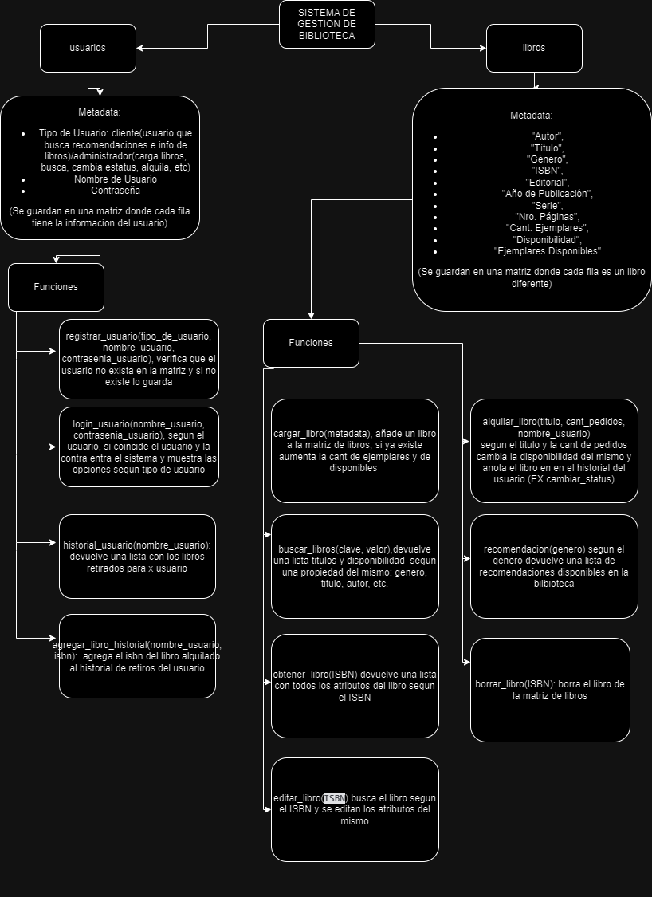

# Sistema de Gestión para una Biblioteca
Trabajo Practico Obligatorio Algoritmos I - UADE  
Autores: Barrón, Melina -  Di Laudo, Camila - Melián, Daniela | Equipo 8

# 🎯 Objetivo
Crear un sistema de gestión para bibliotecas que permita realizar un control del estado de los libros, realizar acciones sobre los mismos y un posterior seguimiento del comportamiento de los usuarios de la misma. 

# 🗺️ Arquitectura 


# 🐍 Funciones

### Barron, Melina
 - recomendar_libros  
 - login_usuario  
 - cambiar_status_usuario
 - borrar_libro
    
### Di Laudo, Camila  
 - registrar_usuarios  
 - editar_libros 
 - main
### Melian, Daniela  
  - busqueda_libros  
 - cargar_libros  
 - obtener_libros
 - agregar_libro_historial  

## 🚀 Getting Started

### Pre - requisitos

> #### Python 
>
> - Ingresar a la sección Descargas de [Python](https://www.python.org/downloads/).
> - Descargar la última versión o >= to 3.8.0.
> - Instalar Python y setear las variables de entorno.
> - Verificar que se haya instalado correctamenete con *python --version* desde cualquier consola/terminal (PowerShell, CMD, bash).
> ```
> PS C:\Users\you_user> python --version
> Python 3.8.0
> ```
